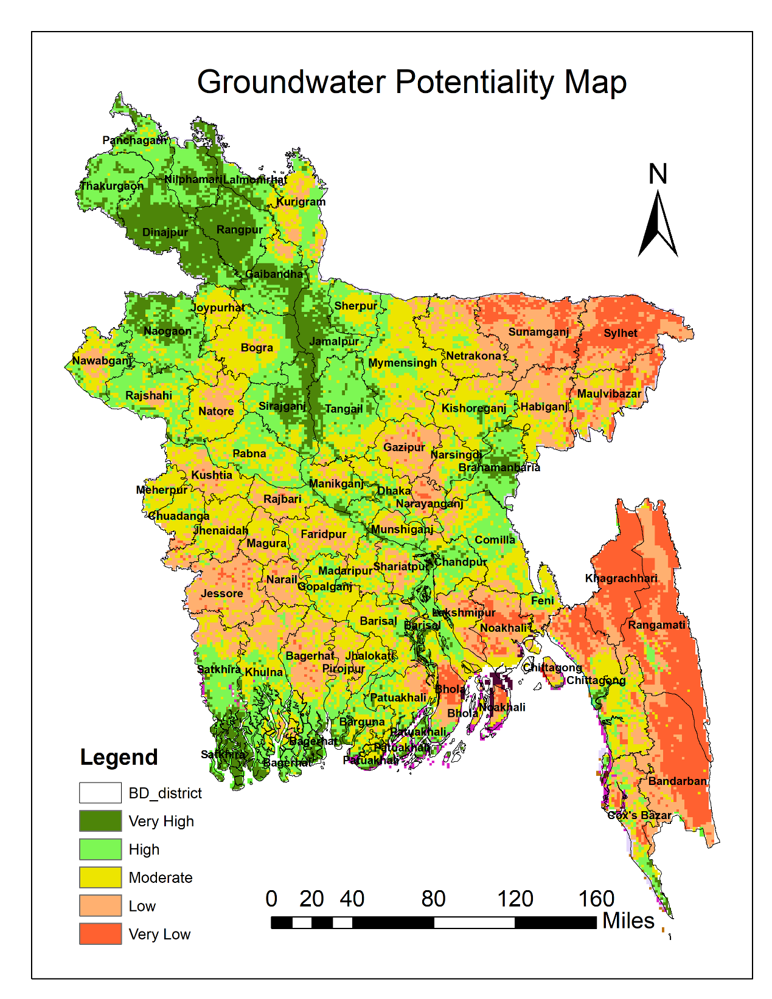
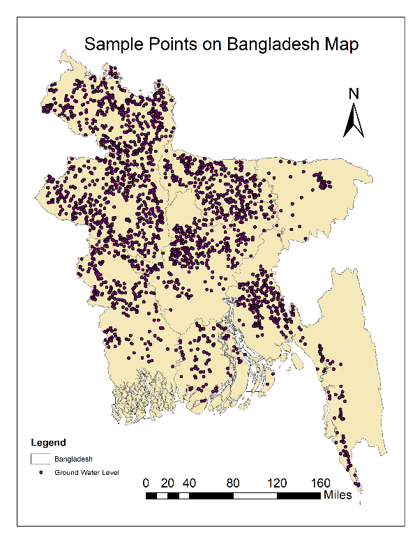
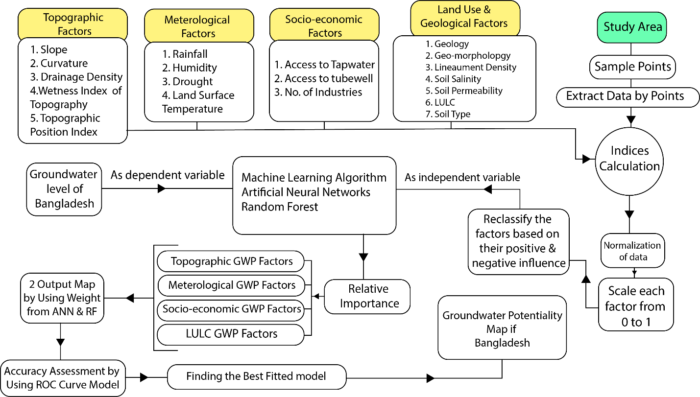
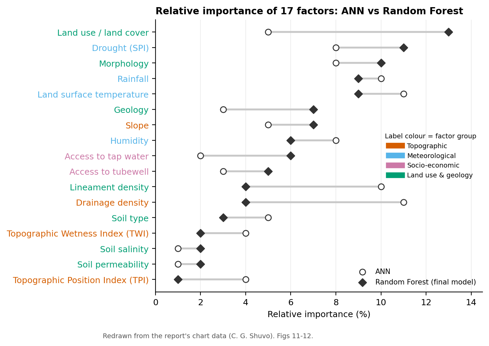
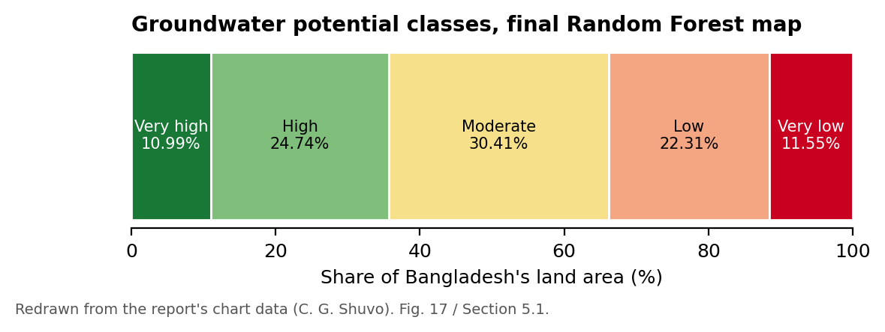
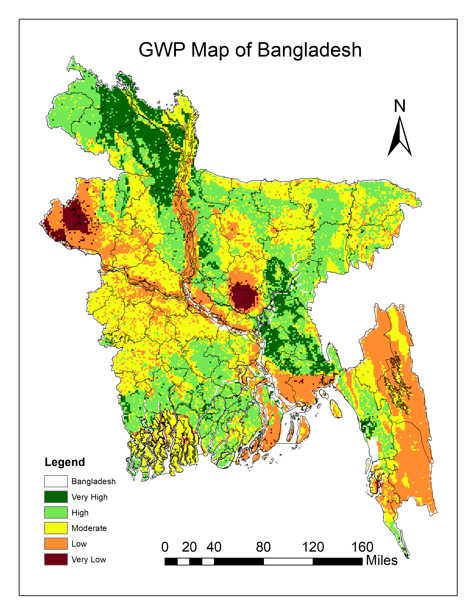
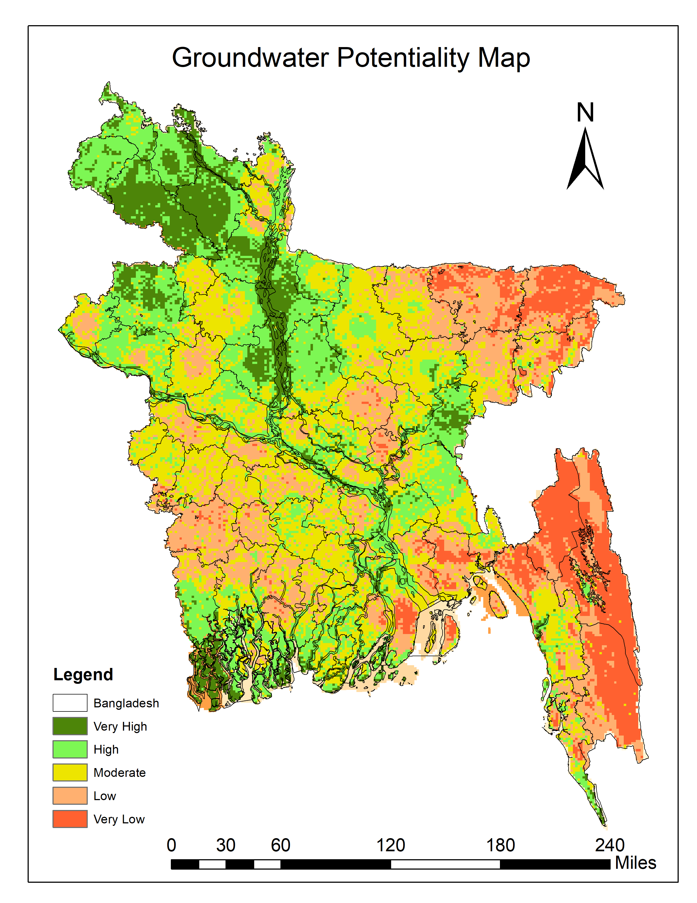

# Groundwater Potential Mapping of Bangladesh with Random Forest and Artificial Neural Networks

## Summary

Groundwater supplies more than 97% of rural water use in Bangladesh. This project maps where the country's groundwater potential is highest. I built 19 topographic, meteorological, socio-economic, land-use and geological factor layers and used 2,144 groundwater sample points as the target. I trained Random Forest (RF) and Artificial Neural Network (ANN) models to weight the factors, and combined the weighted layers into national groundwater-potential (GWP) maps. RF gave the higher ROC area under the curve (AUC 0.97 vs 0.91 for ANN), so its map was adopted as the final result. It classifies **35.73%** of the land as high or very high potential and **33.86%** as low or very low.



## Study area

The whole of **Bangladesh**, located in the Ganges–Brahmaputra–Meghna delta.

## Data

| Group | Factors | Source |
|---|---|---|
| Target | 2,144 sample points coded 1 (potential) / 0 (no potential), selected following Sarkar et al. (2022) | Previous national study |
| Topographic | Slope, curvature, drainage density, TWI, TPI | USGS DEM |
| Meteorological | Rainfall, humidity, drought (SPI) | Bangladesh Agricultural Research Council (BARC) |
| | Land surface temperature | USGS Landsat 8 |
| Socio-economic | Access to tap water, access to tubewell, number of industries | BBS census 2011 |
| Land use & geology | Geology, morphology, soil type, lineament density | USGS + BARC |
| | Land use / land cover | Sentinel-2 |
| | Soil salinity, soil permeability | BARC |



## Method



1. Built all 19 factor rasters and reclassified each one by its positive or negative influence on groundwater.
2. Extracted factor values at the 2,144 sample points (multi-values-to-points).
3. Trained two models in Python (Jupyter) with an 80/20 train–test split:
   - RF: 1,000 trees, out-of-bag sampling
   - ANN: 2 hidden layers of 16 neurons
4. Used each model's relative importance scores as factor weights and combined the rasters in a GIS raster calculator. The GWP index was split into 5 classes with Jenks natural breaks.
5. Compared the models with ROC curves and AUC, computed in SPSS.

## Results

- **Model accuracy:** RF AUC **0.97** vs ANN AUC **0.91**, so the RF-weighted map is the final map.
- **Most influential factors (RF):** land use / land cover (13%), drought (11%), morphology (10%), rainfall (9%) and land surface temperature (9%). The ANN model instead gave the highest weights to drainage density and land surface temperature (11% each).
- **Final GWP classes:** very high 10.99%, high 24.74%, moderate 30.41%, low 22.31%, very low 11.55% of the land area.
- Very high potential appears in districts such as Barisal, Brahmanbaria, Jamalpur, Sirajganj, Naogaon and Lalmonirhat. Very low potential is concentrated in the hill districts (Sylhet, Khagrachari, Rangamati, Bandarban).





| ANN-weighted map | RF-weighted map |
|---|---|
|  |  |

The factor maps and ROC curves are in [`images/`](images/).

## Tools

GIS raster processing and mapping (multi-values-to-points, raster calculator, Jenks classification) · Python (Jupyter) · SPSS (ROC/AUC) · Python/matplotlib for the redrawn charts in [`viz/`](viz/)

## Repository contents

```
images/   original maps, factor layers and ROC curves (unchanged) + redrawn charts
viz/      make_figures.py and data/*.csv (values from the report's charts)
```

## Contact

Chinmoy Ghosh Shuvo · Open to collaboration and knowledge sharing. Feel free to reach out on [LinkedIn](https://www.linkedin.com/in/chinmoyghosh034).
